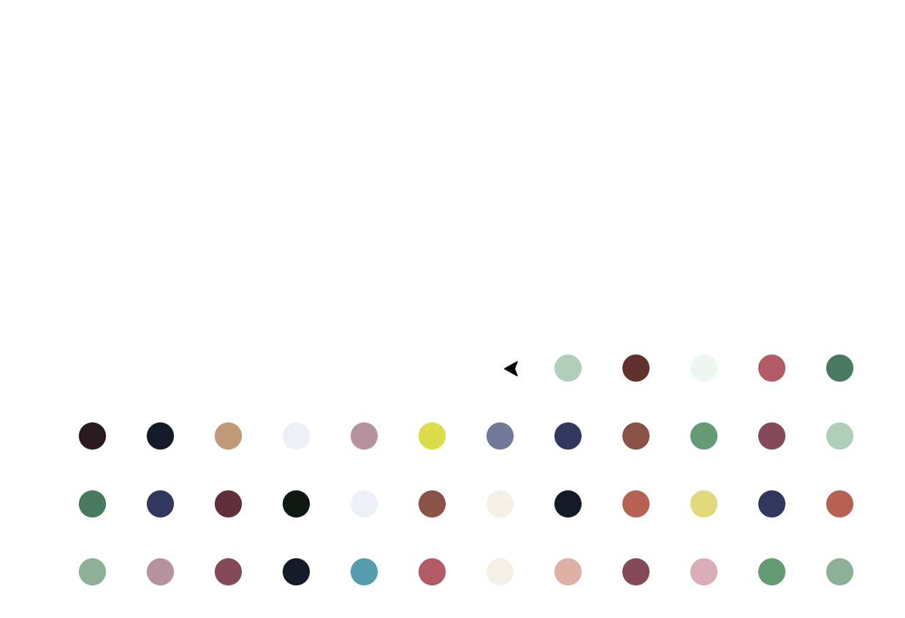

# hirst_turtle

Just for fun. Inspired by Damien Hirst's spot paintings.

To run spirograph: `python3 spirograph.py` (a bit of practise to get the hang of Turtle)

To run hirst painting:
- install colorgram `pip3 install colorgram.py` (extracts colours from an image)
- `python3 hirst.py`

Coding exercise from Angela Yu's course *100 days of code*.

### Images

